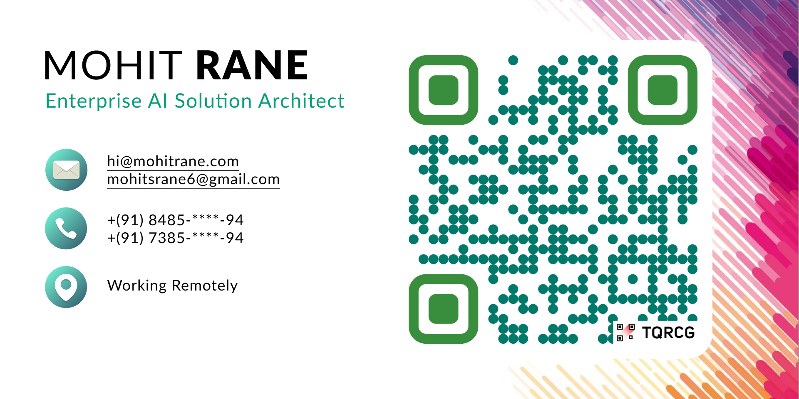

<h1 align="center">Hi 👋, I'm Mohit Rane</h1>
<h3 align="center">A passionate programmer from India</h3>

Software engineer with 3+ years of experience. Worked for innovative projects and large enterprise products. Familiar with both remote, and in-office roles. Always seeking to take ownership of the project and deliver faster than expected. Comfortable for web, backend, and API development.

<!-- 
 
  
 
 

 -->
 

  
  
  
  
 

 

  
  
  
  
  
  

  

- 🔭 I’m currently working on **UA IT(JKH IT)**

- 🌱 I’m currently learning **Devops**

- 👨‍💻 All of my projects are available at [Mohit Coding Lab](https://mohitrane.com/)

- 💬 Ask me about **Javascript, Angular, React, NodeJS and Devops**

- 📫 How to reach me **mohit@mohitrane.com** or **mohitsrane13@gmail.com**

- 📄 Know about my experiences [my experiences](https://mohitrane.com/digital-cv)

- ⚡ Fun fact **I think I'm funny**

 
<h3 align="left">Connect with me:</h3>

 

<h3 align="left">Languages and Tools:</h3>

- Frontend

  

- Backend

  

- Database

  

- Cloud Servers

  

- Tools

  

<!--   -->

<!--  -->

   

 <em><b>I love connecting with different people</b> so if you want to say <b>hi, I'll be happy to meet you more!</b> :)</em>

 

 Created with 🧡 by <a href="https://mohitrane.com/">Mohit Rane</a>

