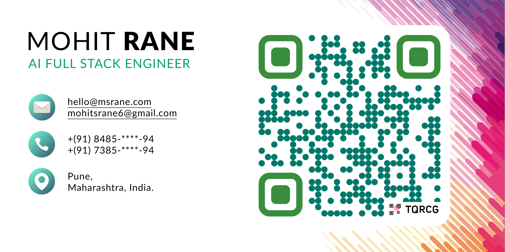
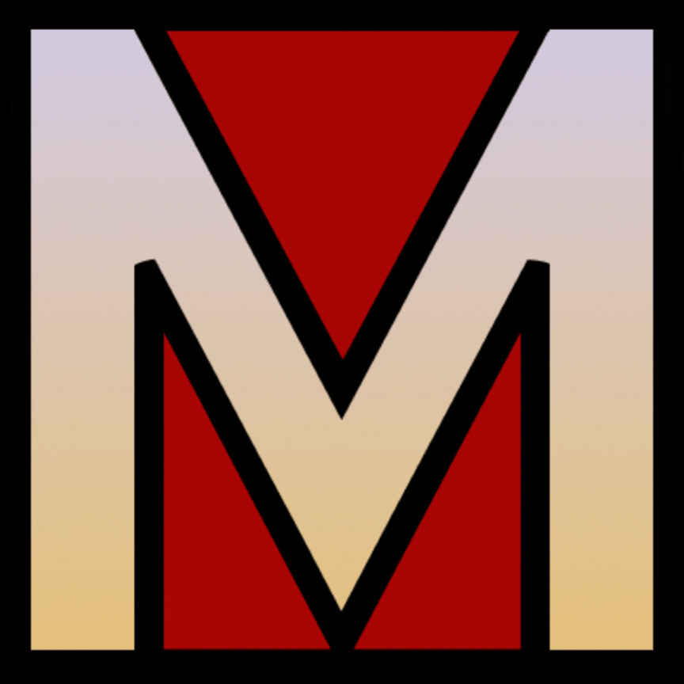

<h1 align="center">Hi 👋, I'm Mohit Rane</h1>
<h3 align="center">AI Full Stack Engineer & DevOps Strategist</h3>

I specialize in building full-stack, production-ready SaaS platforms powered by AI, RAG (Retrieval-Augmented Generation), Cloud DevOps, and thoughtful Software Architecture. My mission is to solve real-world problems at scale by combining engineering depth with product-first thinking.

<!-- 
 
  
 
 

 -->
 

  
  
  
  
 

 

  
  
  
  
  
  

  

## Who I Am
I’m transitioning from a Full Stack Developer to a **Software Architect & AI Product Builder**. Over the last few years, I’ve built and delivered multiple high-impact freelance and productized solutions across domains like real estate, edtech, finance, and devtools.

Currently, I’m building **EagleSON Engine** – an AI-powered platform to help developers, students, and professionals crack interviews using real-world Q&A, master answers, voice feedback, and RAG intelligence.

  

## What I Work On

- 🧱 **AI + RAG-based Full Stack Applications**
- 🖥️ **Frontend Engineering**: React, Angular, Tailwind, Framer Motion
- 🔧 **Backend Systems**: Node.js, Express, MongoDB, PostgreSQL
- ☁️ **DevOps & Infra**: AWS (EC2, S3, Route 53, Lambda), Docker, GitHub Actions, CI/CD, Nginx
- 🧠 **GenAI / LLM**: Prompt Engineering, LangChain, Embeddings, Vector DBs (Pinecone, Chroma)
- 🎯 **Architecture & Strategy**: Monorepo, Domain-driven design, Modularization, Performance Tuning

  

## 🌐 Projects That Reflect Me

- **RanSON Engine** – AI-driven Interview Preparation Engine (RAG-based)
- **Property On Location** – 99acres-style Real Estate Platform (Full Stack Freelance Project)
- **AI-Powered Portfolio Engine** – Contextual insights + publishing tools for learners and professionals
- **CI/CD + Auto Infra Deployment Tools** – DevOps pipelines for microservices and SaaS products

> More projects: [📁 Mohit Coding Lab](https://github.com/Mohit-S-Rane) (coming soon: split public/private showcases)

  

## Topics I Love To Talk About

- Building AI-native SaaS
- Architecting scalable full-stack systems
- Real-world GenAI use cases (beyond playgrounds)
- Developer productivity & workflow automation
- Strategic career growth through product thinking

  

## Currently

- 🔭 **Building**: RanSON Engine (CareerOS meets Interview AI)
- ✍️ **Sharing**: Insights on product-building, system design, and AI on [LinkedIn](https://linkedin.com/in/mohit-s-rane)

  

## Fun but True
I build for impact, think in systems, and believe in sharing everything I learn.  
I might debug your app and pitch a product idea in the same breath.

 
<h3 align="left">Connect with me:</h3>

 

<h3 align="left">Languages and Tools:</h3>

- Frontend

  

- Backend

  

- Database

  

- Cloud Servers

  

- Tools

  

<!--   -->

<!--  -->

   

 <em><b> "Let’s build something new" </b> — one smart tool at a time. so if you want to say <b>hi, I'll be happy to meet you more!</b> :)</em>

 

 Created with 🧡 by <a href="https://msrane.com/">Mohit Rane</a>

